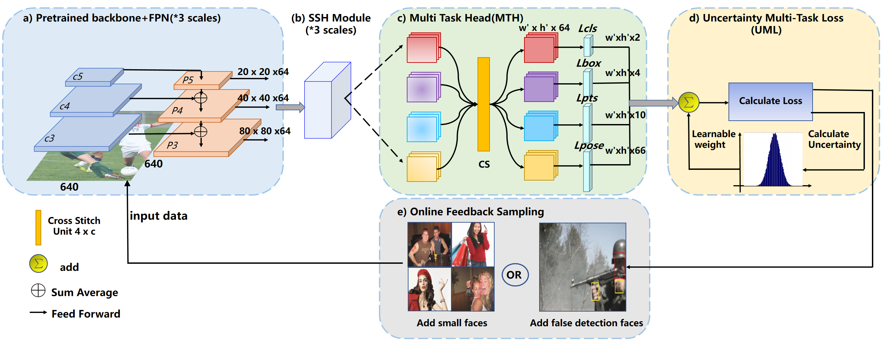

# MOS-Multi-Task-Face-Detect
<div align="center"></div>


## Introduction
This repo is the official implementation of "MOS: A Low Latency and Lightweight Framework for Face Detection, Landmark Localization, and Head Pose Estimation". The paper has been accepted at BMVC2021.

This repo is an implementation of PyTorch. MOS is a low latency and lightweight architecture for face detection, facial landmark localization and head pose estimation.It aims to bridge the gap between research and industrial communities.
For more details, please refer to our [report on Arxiv](https://arxiv.org/abs/2110.10953).

## Updates
* 【2021/10/31】 We have released the training data (widerface with pose label). The pytorch inference code of MOS-S and MOS-M has been released!
* 【2021/10/22】 We have released our paper on [Arxiv](https://arxiv.org/abs/2110.10953).
* 【2021/10/15】 "MOS: A Low Latency and Lightweight Framework for Face Detection, Landmark Localization, and Head Pose Estimation" has been accepted at BMVC2021.

## Comming soon
- [ ] Tensorrt inference code.
- [ ] Openvino inference code.
- [ ] Ncnn inference code.
- [ ] The fastest version: MOS-tiny.


## Benchmark


#### Light Models.
WiderFace Val Performance is in multi scale and Pose evaluation is using AFLW2000 in 300X300 as image input.

|Model |backbone |easy | medium |hard| pitch | yaw | roll |
| ------        |:---:  |  :---:       |:---:     |:---:  | :---: |:---: |:---: 
|MOS-M|mobilenetV2  |94.08  | 93.21 |88.06 | 6.67 |4.43 |5.83 |
|MOS-S|shufflenetV2 |93.28 | 92.12 |86.97 | 6.80 |4.28 |5.99 |
#### generate widerface validation results
1. Generate txt file
You need download the validation and test dataset of WiderFace from [Here](https://github.com/wondervictor/WiderFace-Evaluation)
```Shell
python test_widerface.py --network cfg_mos_m --trained_model ./test_weights/MOS-M.pth
```
2. Evaluate txt results. Demo come from [Here](https://github.com/wondervictor/WiderFace-Evaluation)
```Shell
cd ./widerface_evaluate
python setup.py build_ext --inplace
python evaluation.py
```

## Training data
1. Download annotations (face bounding boxes & five facial landmarks & pose angle(pitch,yaw,roll)) from [baidu cloud](https://pan.baidu.com/s/1GizI6v9p0yUnh2sCWaDERg) , the code is 0925. 
We also provide the [GOOGLE DRIVE](https://drive.google.com/file/d/1lwdl1HpVTmWU1yjGYY5NufFdIsdf0R1Q/view?usp=sharing)
2. Organise the dataset directory as follows:
```Shell
  ./data/widerface/
    train/
      images/
      label.txt
```

The annotation file  is like:
```Shell
# 0--Parade/0_Parade_marchingband_1_849.jpg
449 330 122 149 488.906 373.643 0.0 542.089 376.442 0.0 515.031 412.83 0.0 485.174 425.893 0.0 538.357 431.491 0.0 0.82 -6 -6 1

face_x face_y face_width face_height landmark1.x landmark1.y 0.0 landmark2.x landmark2.y 0.0 landmark3.x landmark3.y 0.0 landmark4.x landmark4.y 0.0
landmark5.x landmark5.y 0.0 confidence pitch yaw roll
```

## Quick Start


<summary>Installation</summary>

Step1. Install MOS.
```shell
git clone https://github.com/lyp-deeplearning/MOS-Multi-Task-Face-Detect.git
cd MOS-Multi-Task-Face-Detect
conda create -n MOS python=3.8.5
conda activate MOS
pip install -r requirements.txt
cd models/DCNv2/
python setup.py build develop
```

Step2. Run Pytorch inference demo.
```shell
## run the MOS-M model 
python detect_picture.py --network cfg_mos_m --trained_model ./test_weights/MOS-M.pth
## run the MOS-S model
python detect_picture.py --network cfg_mos_s --trained_model ./test_weights/MOS-S.pth
```

Step3. Run video inference demo.
```shell
## run the MOS-M model 
python detect_video.py --network cfg_mos_m --trained_model ./test_weights/MOS-M.pth
```

## Cite MOS
If you use MOS in your research, please cite our work by using the following BibTeX entry:

```latex
@article{liu2021mos,
  title={MOS: A Low Latency and Lightweight Framework for Face Detection, Landmark Localization, and Head Pose Estimation},
  author={Liu, Yepeng and Gu, Zaiwang and Gao, Shenghua and Wang, Dong and Zeng, Yusheng and Cheng, Jun},
  journal={arXiv preprint arXiv:2110.10953},
  year={2021}
}
```
